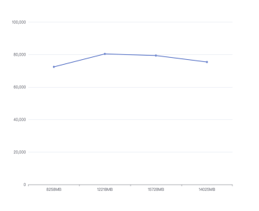
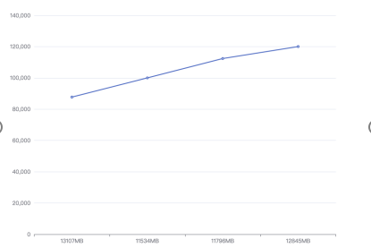
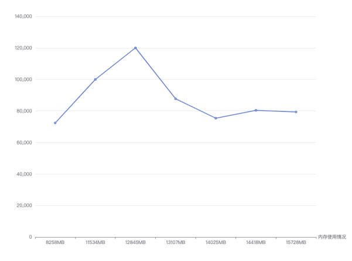

# D2T 实时测试

## 测试环境

**硬件资源配置如下：**

* CPU：40核，Intel(R) Xeon(R) CPU E5-2670 v2 @ 2.50GHz
* 内存：4*32G
* 网卡：1Gbps
* 操作系统：Linux x86_64
* MongoDB 版本：0.1
* 硬盘：SSD

**测试条件**

测试数据涵盖以下维度：时延、QPS、CPU使用率、内存使用率。所有值均由 10 秒的平均值给出。

QPS来自数据平台的日志输出信息，每秒统计OPLOG写入次数；我们还给出了 CPU 和内存使用情况。

## 测试结果

    当cacheBucketSize=16  cacheBucketNum=16  dataBatchSize=128 时：

### 测试一

**配置信息**

| 参数                      | 介绍                                     |
|--------------------------|-----------------------------------------|
| MongoDB 类型              | 源端MongoDB：单节点副本集，cacheSize30GB  目标MongoDB：单节点副本集，cacheSize30GB |
| 数据量                    | 一个DataBase共10个集合，每个文档包含7列，每个文档的总大小约为140字节               |
| 实时同步线程数             | {oplogNS=1, oplogWrite=6, oplogRead=1, oplogNsBucket=2}                      |
| 缓存区                    | cacheBucketSize=16  cacheBucketNum=16  dataBatchSize=128                      |

**测试结果**

| 测量       | 描述         |
|-----------|-------------|
| QPS       | 72398       |
| CPU使用率 | 280%        |
| 内存使用情况 | 8258MB    |

------------

### 测试二

**配置信息**

| 参数             | 介绍                                     |
|------------------|------------------------------------------|
| MongoDB 类型     | 源端MongoDB：单节点副本集，cacheSize30GB；目标MongoDB：单节点副本集，cacheSize30GB |
| 数据量           | 一个DataBase共10个集合，每个文档包含7列，每个文档的总大小约为140字节                 |
| 实时同步线程数   | {oplogNS=1, oplogWrite=9, oplogRead=1, oplogNsBucket=3}                             |
| 缓存区           | cacheBucketSize=16; cacheBucketNum=16; dataBatchSize=128                             |

**测试结果**

| 测量         | 描述           |
|--------------|---------------|
| QPS          | 80385         |
| CPU使用率    | 240%          |
| 内存使用情况 | 14418MB       |

-------------

### 测试三

**配置信息**

| 参数               | 介绍                                                         |
|--------------------|-------------------------------------------------------------|
| MongoDB 类型       | 源端MongoDB：单节点副本集，cacheSize30GB 目标MongoDB：单节点副本集，cacheSize30GB  |
| 数据量             | 一个DataBase共10个集合，每个文档包含7列，每个文档的总大小约为140字节                |
| 实时同步线程数     | {oplogNS=1, oplogWrite=12, oplogRead=1, oplogNsBucket=4}    |
| 缓存区             | cacheBucketSize=16 cacheBucketNum=16 dataBatchSize=128 |

**测试结果**

| 测量       | 描述          |
|------------|--------------|
| QPS        | 79365        |
| CPU使用率  | 280%         |
| 内存使用情况 | 15728MB      |

------------

### 测试四

**配置信息**

| 参数           | 介绍                                 |
|----------------|-------------------------------------|
| MongoDB 类型   | 源端MongoDB：单节点副本集，cacheSize30GB ，目标MongoDB：单节点副本集，cacheSize30GB   |
| 数据量         | 一个DataBase共10个集合，每个文档包含7列，每个文档的总大小约为140字节   |
| 实时同步线程数 | {oplogNS=1, oplogWrite=15, oplogRead=1, oplogNsBucket=5}  |
| 缓存区         | cacheBucketSize=16，cacheBucketNum=16，dataBatchSize=128   |

**测试结果**

| 测量       | 描述           |
|------------|---------------|
| QPS        | 75388         |
| CPU使用率  | 280%          |
| 内存使用情况 | 14025MB       |

### 统计

<table>
  <tr>
    <th>缓存区</th>
    <th>oplogNS</th>
    <th>oplogWrite</th>
    <th>oplogRead</th>
    <th>oplogNsBucket</th>
    <th>QPS</th>
    <th>CPU使用率</th>
    <th>内存使用情况</th>
  </tr>
  <tr>
    <td rowspan="4">cacheBucketSize=16 cacheBucketNum=16 dataBatchSize=128</td>
    <td>1</td>
    <td>6</td>
    <td>1</td>
    <td>2</td>
    <td>72398</td>
    <td>280%</td>
    <td>8258MB</td>
  </tr>
  <tr>
    <td>1</td>
    <td>9</td>
    <td>1</td>
    <td>3</td>
    <td>80385</td>
    <td>240%</td>
    <td>14418MB</td>
  </tr>
  <tr>
    <td>1</td>
    <td>12</td>
    <td>1</td>
    <td>4</td>
    <td>79365</td>
    <td>280%</td>
    <td>15728MB</td>
  </tr>
  <tr>
    <td>1</td>
    <td>15</td>
    <td>1</td>
    <td>5</td>
    <td>75388</td>
    <td>280%</td>
    <td>14025MB</td>
  </tr>
</table>

总结：当cacheBucketSize=16，cacheBucketNum=16，dataBatchSize=128时，可以看出当线程数增加时：

（1）当线程数增加时，并不会提高QPS，原因是受缓存区大小的限制。

---------

    当cacheBucketSize=32  cacheBucketNum=32  dataBatchSize=128 时：

### 测试一

**配置信息**

| 参数        | 介绍                                               |
|-------------|---------------------------------------------------|
| MongoDB 类型 | 源端MongoDB：单节点副本集，cacheSize30GB ，目标MongoDB：单节点副本集，cacheSize30GB          |
| 数据量       | 一个DataBase共10个集合，每个文档包含7列，每个文档的总大小约为140字节。|
| 实时同步线程数| {oplogNS=1, oplogWrite=6, oplogRead=1, oplogNsBucket=2} |
| 缓存区      | cacheBucketSize=32  ，cacheBucketNum=32    ， dataBatchSize=128                                 |

**测试结果**

| 测量       | 描述           |
|-------------|---------------|
| QPS         | 87719         |
| CPU使用率   | 240%          |
| 内存使用情况 | 13107MB       |

----------

### 测试二

**配置信息**

| 参数                | 介绍                                                     |
|----------------------|---------------------------------------------------------|
| MongoDB 类型        | 源端MongoDB：单节点副本集，cacheSize30GB ， 目标MongoDB：单节点副本集，cacheSize30GB                |
| 数据量               | 一个DataBase共10个集合，每个文档包含7列，每个文档的总大小约为140字节。  |
| 实时同步线程数       | {oplogNS=1, oplogWrite=9, oplogRead=1, oplogNsBucket=3}   |
| 缓存区               | cacheBucketSize=32 ， cacheBucketNum=32， dataBatchSize=128                                        |

**测试结果**

| 测量       | 描述           |
|-------------|---------------|
| QPS         | 100000        |
| CPU使用率   | 320%          |
| 内存使用情况 | 11534MB       |

---------

### 测试三

**配置信息**

| 参数          | 介绍                                                                                     |
|---------------|------------------------------------------------------------------------------------------|
| MongoDB 类型  | 源端MongoDB：单节点副本集，cacheSize30GB 目标MongoDB：单节点副本集，cacheSize30GB   |
| 数据量        | 一个DataBase共10个集合，每个文档包含7列，每个文档的总大小约为140字节。                   |
| 实时同步线程数 | {oplogNS=1, oplogWrite=12, oplogRead=1, oplogNsBucket=4}                                  |
| 缓存区        | cacheBucketSize=32 cacheBucketNum=32 dataBatchSize=128                              |

**测试结果**

| 测量       | 描述        |
|------------|-------------|
| QPS        | 11237       |
| CPU使用率  | 320%        |
| 内存使用情况 | 11796MB     |

----------

### 测试四

**配置信息**

| 参数         | 介绍                                              |
|--------------|--------------------------------------------------|
| MongoDB 类型 | 源端MongoDB：单节点副本集，cacheSize30GB， 目标MongoDB：单节点副本集，cacheSize30GB         |
| 数据量       | 一个DataBase共10个集合，每个文档包含7列，每个文档的总大小约为140字节 |
| 实时同步线程数 | {oplogNS=1, oplogWrite=15, oplogRead=1, oplogNsBucket=5} |
| 缓存区       | cacheBucketSize=32， cacheBucketNum=32  ， dataBatchSize=128                                |

**测试结果**

| 测量       | 描述           |
|-------------|---------------|
| QPS         | 12003         |
| CPU使用率   | 360%          |
| 内存使用情况 | 12845MB       |

### 统计：

<table>
  <tr>
    <th>缓存区</th>
    <th>oplogNS</th>
    <th>oplogWrite</th>
    <th>oplogRead</th>
    <th>oplogNsBucket</th>
    <th>QPS</th>
    <th>CPU使用率</th>
    <th>内存使用情况</th>
  </tr>
  <tr>
    <td rowspan="4">cacheBucketSize=32 cacheBucketNum=32 dataBatchSize=128</td>
    <td>1</td>
    <td>6</td>
    <td>1</td>
    <td>2</td>
    <td>87719</td>
    <td>240%</td>
    <td>13107MB</td>
  </tr>
  <tr>
    <td>1</td>
    <td>9</td>
    <td>1</td>
    <td>3</td>
    <td>100000</td>
    <td>320%</td>
    <td>11534MB</td>
  </tr>
  <tr>
    <td>1</td>
    <td>12</td>
    <td>1</td>
    <td>4</td>
    <td>112370</td>
    <td>320%</td>
    <td>11796MB</td>
  </tr>
  <tr>
    <td>1</td>
    <td>15</td>
    <td>1</td>
    <td>5</td>
    <td>120030</td>
    <td>360%</td>
    <td>12845MB</td>
  </tr>
</table>

总结：当cacheBucketSize=32，cacheBucketNum=32，dataBatchSize=128时，可以看出当线程数增加时：

（1）当线程数增加时，会提高QPS，原因是受每秒读取Oplog量的限制。

## 总结：

（1）CPU与QPS：

（2）内存使用情况与QPS：

