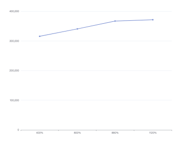
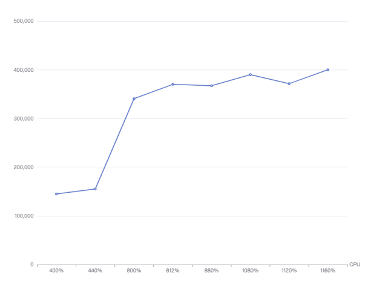

# MongoT 全量测试

## 测试环境

**硬件资源配置如下：**

* CPU：40核，Intel(R) Xeon(R) CPU E5-2670 v2 @ 2.50GHz
* 内存：4*32G
* 网卡：1Gbps
* 操作系统：Linux x86_64
* MongoDB 版本：0.1
* 硬盘：SSD

**测试条件**

测试数据涵盖以下维度：时延、QPS、CPU使用率、内存使用率。所有值均由 10 秒的平均值给出。

QPS来自数据平台的日志输出信息，每秒统计OPLOG写入次数；我们还给出了 CPU 和内存使用情况。

## 测试结果

    当cacheBucketSize=32  cacheBucketNum=32  dataBatchSize=128 时：

### 测试一

**配置信息**

| 参数             | 介绍                                       |
|-----------------|------------------------------------------|
| MongoDB 类型     | 源端MongoDB：单节点副本集，cacheSize为30GB 目标MongoDB：单节点副本集，cacheSize为30GB  |
| 数据量           | 一个db共10个集合，每个文档包含7列，每个oplog文档的总大小约为140字节。                    |
| 源端读取线程数   | 5                                        |
| 目标端写入线程数 | 15                                       |
| 缓存区           | cacheBucketSize=32 cacheBucketNum=32 dataBatchSize=128                           |

**测试结果：**

| 测量     | 描述       |
|----------|------------|
| QPS      | 145062     |
| CPU使用率 | 400%       |
| 内存使用情况 | 13631MB  |

------

### 测试二

**配置信息**

| 参数            | 介绍                                  |
|-----------------|---------------------------------------|
| MongoDB类型     | 源端MongoDB：单节点副本集，cacheSize30GB 目标MongoDB：单节点副本集，cacheSize30GB |
| 数据量          | 一个DataBase共10个集合，每个文档包含7列，每个文档的总大小约为140字节。          |
| 源端读取线程数  | 6                                     |
| 目标端写入线程数 | 20                                    |
| 缓存区          | cacheBucketSize=32 cacheBucketNum=32 dataBatchSize=128                  |

**测试结果**

| 测量     | 描述        |
|---------|-------------|
| QPS     | 160837      |
| CPU使用率 | 440%       |
| 内存使用情况 | 16384MB   |

----------

### 测试三

**配置信息**

| 参数          | 介绍                                          |
|---------------|-----------------------------------------------|
| MongoDB 类型 | 源端MongoDB：单节点副本集，cacheSize30GB 目标MongoDB：单节点副本集，cacheSize30GB |
| 数据量        | 一个DataBase共10个集合，每个文档包含7列，每个文档的总大小约为140字节。               |
| 源端读取线程数 | 6                                             |
| 目标端写入线程数 | 24                                            |
| 缓存区        | cacheBucketSize=32 cacheBucketNum=32 dataBatchSize=128                   |

**测试结果**

| 描述          | 测量      |
|--------------|-----------|
| QPS          | 155232    |
| CPU使用率    | 440%      |
| 内存使用情况  | 15860MB   |

### 统计

<table>
  <tr>
    <th>缓存区</th>
    <th>cacheSize</th>
    <th>源端读取线程数</th>
    <th>目标端写入线程数</th>
    <th>QPS</th>
    <th>内存使用情况</th>
    <th>CPU使用率</th>
  </tr>
  <tr>
    <td rowspan="3">cacheBucketSize=32 cacheBucketNum=32 dataBatchSize=128</td>
    <td rowspan="3">30GB</td>
    <td>5</td>
    <td>15</td>
    <td>145062</td>
    <td>13631MB</td>
    <td>400%</td>
  </tr>
  <tr>
    <td>6</td>
    <td>20</td>
    <td>160837</td>
    <td>16384MB</td>
    <td>440%</td>
  </tr>
  <tr>
    <td>6</td>
    <td>24</td>
    <td>155232</td>
    <td>15860MB</td>
    <td>440%</td>
  </tr>
</table>

 

总结：当cacheBucketSize=32，cacheBucketNum=32，dataBatchSize=128时，可以看出当线程数增加的时：

（1）不会提高QPS，原因是读取量小于写入量；

（2）内存使用率不会提升，原因是cache缓存区有限制。

-------------

    当cacheBucketSize=48  cacheBucketNum=48  dataBatchSize=128 时：

### 测试一

**配置信息**

| 参数           | 介绍                                          |
|----------------|-----------------------------------------------|
| MongoDB 类型   | 源端MongoDB：单节点副本集，cacheSize30GB；目标MongoDB：单节点副本集，cacheSize30GB |
| 数据量         | 一个DataBase共10个集合，每个文档包含7列，每个文档的总大小约为140字节               |
| 源端读取线程数 | 5                                             |
| 目标端写入线程数 | 15                                            |
| 缓存区         | cacheBucketSize=48 cacheBucketNum=48 dataBatchSize=128 |

**测试结果**

| 测量     | 描述            |
|---------|-----------------|
| QPS     | 315702          |
| CPU使用率 | 400%            |
| 内存使用情况 | 31326MB       |

--------

#### 测试二

**配置信息**

| 参数              | 介绍                                                   |
|--------------------|--------------------------------------------------------|
| MongoDB 类型        | 源端MongoDB：单节点副本集，cacheSize30GB 目标MongoDB：单节点副本集，cacheSize30GB |
| 数据量              | 一个DataBase共10个集合，每个文档包含7列，每个文档的总大小约为140字节                          |
| 源端读取线程数       | 6                                                      |
| 目标端写入线程数     | 20                                                     |
| 缓存区              | cacheBucketSize=48 cacheBucketNum=48 dataBatchSize=128                     |

**测试结果**

| 测量       | 描述         |
|-------------|--------------|
| QPS         | 340716       |
| CPU使用率    | 800%         |
| 内存使用情况  | 24773MB      |

### 测试三

**配置信息**

| 参数               | 介绍                                             |
|---------------------|--------------------------------------------------|
| MongoDB 类型       | 源端MongoDB：单节点副本集，cacheSize30GB 目标MongoDB：单节点副本集，cacheSize30GB  |
| 数据量             | 一个DataBase共10个集合，每个文档包含7列，每个文档的总大小约为140字节            |
| 源端读取线程数      | 6                                               |
| 目标端写入线程数    | 24                                              |
| 缓存区             | cacheBucketSize=48 cacheBucketNum=48 dataBatchSize=128                     |

**测试结果**

| 测量       | 描述           |
|-------------|---------------|
| QPS         | 367178        |
| CPU使用率   | 880%          |
| 内存使用情况 | 23986MB       |

--------

### 测试四

**配置信息**

| 参数             | 介绍                                                         |
|------------------|--------------------------------------------------------------|
| MongoDB 类型      | 源端MongoDB：单节点副本集，cacheSize30GB 目标MongoDB：单节点副本集，cacheSize30GB |
| 数据量            | 一个DataBase共10个集合，每个文档包含7列，每个文档的总大小约为140字节          |
| 源端读取线程数    | 8                                                            |
| 目标端写入线程数  | 24                                                           |
| 缓存区           | cacheBucketSize=48 cacheBucketNum=48 dataBatchSize=128   |

**测试结果**

| 测量         | 描述           |
|---------------|---------------|
| QPS           | 371528        |
| CPU使用率     | 1120%         |
| 内存使用情况   | 27132MB       |

---------

### 统计

<table>
  <tr>
    <th>缓存区</th>
    <th>cacheSize</th>
    <th>源端读取线程数</th>
    <th>目标端写入线程数</th>
    <th>QPS</th>
    <th>内存使用情况</th>
    <th>CPU使用率</th>
  </tr>
  <tr>
    <td rowspan="4">cacheBucketSize=48 cacheBucketNum=48 dataBatchSize=128</td>
    <td rowspan="4">30GB</td>
    <td>5</td>
    <td>15</td>
    <td>315702</td>
    <td>31326MB</td>
    <td>400%</td>
  </tr>
  <tr>
    <td>6</td>
    <td>20</td>
    <td>340716</td>
    <td>24773MB</td>
    <td>800%</td>
  </tr>
  <tr>
    <td>6</td>
    <td>24</td>
    <td>367178</td>
    <td>23986MB</td>
    <td>880%</td>
  </tr>
  <tr>
    <td>8</td>
    <td>24</td>
    <td>371528</td>
    <td>27132MB</td>
    <td>1120%</td>
  </tr>
</table>

总结：当cacheBucketSize=48，cacheBucketNum=48，dataBatchSize=128时，可以看出当线程数增加的时：

（1）提高QPS。

--------------

    当cacheBucketSize=64  cacheBucketNum=64  dataBatchSize=128 时：

### 测试一

**配置信息**

| 参数                  | 介绍                                       |
|-----------------------|------------------------------------------|
| MongoDB 类型          | 源端MongoDB：单节点副本集，cacheSize30GB    目标MongoDB：单节点副本集，cacheSize30GB   |
| 数据量                | 一个DataBase共10个集合，每个文档包含7列，每个文档的总大小约为140字节 |
| 源端读取线程数        | 5                                        |
| 目标端写入线程数      | 15                                       |
| 缓存区                | cacheBucketSize=64   cacheBucketNum=64 dataBatchSize=128                        |

**测试结果**

| 测量         | 描述         |
|---------------|---------------|
| QPS         | 370042      |
| CPU使用率   | 812%         |
| 内存使用情况 | 25159MB    |

-----------

### 测试二

**配置信息**

| 测量         | 描述         |
|---------------|---------------|
| MongoDB 类型 | 源端MongoDB：单节点副本集，cacheSize30GB 目标MongoDB：单节点副本集，cacheSize30GB |
| 数据量        | 一个DataBase共10个集合，每个文档包含7列，每个文档的总大小约为140字节。         |
| 源端读取线程数 | 6           |
| 目标端写入线程数 | 20         |
| 缓存区        | cacheBucketSize=64 cacheBucketNum=64 dataBatchSize=128                     |

**测试结果**

| 测量         | 描述         |
|---------------|---------------|
| QPS           | 390000        |
| CPU使用率     | 1080%         |
| 内存使用情况   | 26522MB       |

------------

### 测试三

**配置信息**

| 参数               | 介绍                                                     |
|-------------------|---------------------------------------------------------|
| MongoDB 类型       | 源端MongoDB：单节点副本集，cacheSize30GB 目标MongoDB：单节点副本集，cacheSize30GB |
| 数据量             | 一个DataBase共10个集合，每个文档包含7列，每个文档的总大小约为140字节。                       |
| 源端读取线程数     | 6                                                       |
| 目标端写入线程数   | 24                                                      |
| 缓存区             | cacheBucketSize=64 cacheBucketNum=64 dataBatchSize=128   |

**测试结果**

| 测量          | 描述           |
|--------------|---------------|
| QPS          | 400138        |
| CPU使用率    | 1160%         |
| 内存使用情况  | 26655MB       |

-------------

### 测试四

**配置信息**

| 参数          | 介绍                                                          |
|--------------|--------------------------------------------------------------|
| MongoDB 类型  | 源端MongoDB：单节点副本集，cacheSize30GB  目标MongoDB：单节点副本集，cacheSize30GB |
| 数据量         | 一个DataBase共10个集合，每个文档包含7列，每个文档的总大小约为140字节。           |
| 源端读取线程数 | 8                                                            |
| 目标端写入线程数 | 24                                                           |
| 缓存区         | cacheBucketSize=64 cacheBucketNum=64 dataBatchSize=128       |

**测试结果**

| 测量       | 描述           |
|------------|---------------|
| QPS        | 360209        |
| CPU使用率  | 1120%         |
| 内存使用情况 | 25252MB       |

### 统计：

<table>
  <tr>
    <th>缓存区</th>
    <th>cacheSize</th>
    <th>源端读取线程数</th>
    <th>目标端写入线程数</th>
    <th>QPS</th>
    <th>内存使用情况</th>
    <th>CPU使用率</th>
  </tr>
  <tr>
    <td rowspan="4">cacheBucketSize=64 cacheBucketNum=64 dataBatchSize=128</td>
    <td rowspan="4">30GB</td>
    <td>5</td>
    <td>15</td>
    <td>370042</td>
    <td>25159MB</td>
    <td>812%</td>
  </tr>
  <tr>
    <td>6</td>
    <td>20</td>
    <td>390000</td>
    <td>26522MB</td>
    <td>1080%</td>
  </tr>
  <tr>
    <td>6</td>
    <td>24</td>
    <td>400138</td>
    <td>26655MB</td>
    <td>1160%</td>
  </tr>
  <tr>
    <td>8</td>
    <td>24</td>
    <td>360209</td>
    <td>25252MB</td>
    <td>1120%</td>
  </tr>
</table>

总结：当cacheBucketSize=64，cacheBucketNum=64，dataBatchSize=128时，可以看出当线程数增加的时：

（1）会提高QPS，但是效果不明显，同时当线程数较大增加时，CPU使用率也会略有下降。

## 总结：

（1）CPU与QPS：

（2）内存使用情况与QPS：

